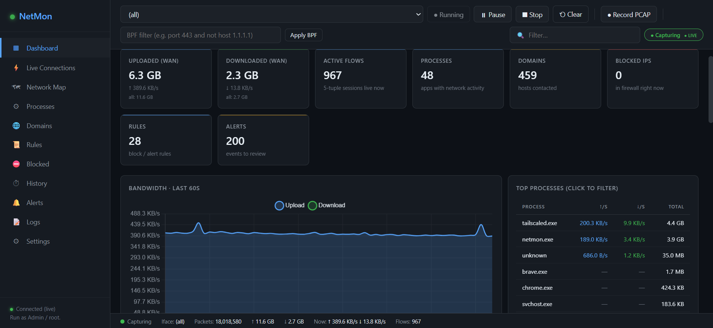
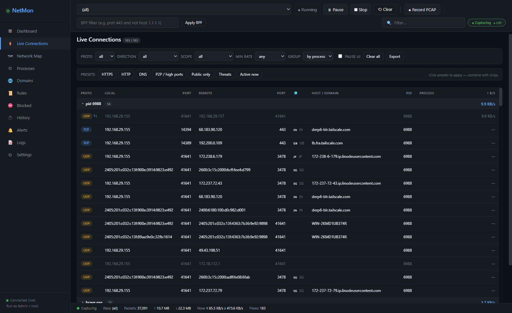
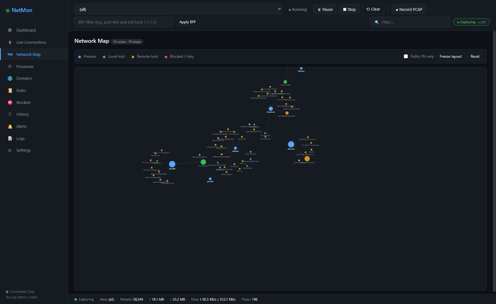
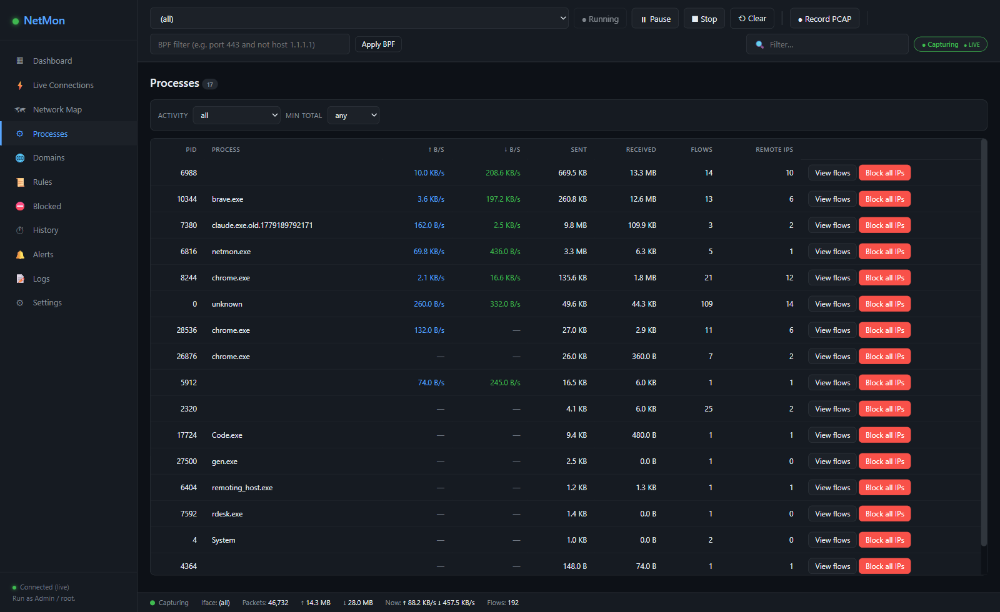
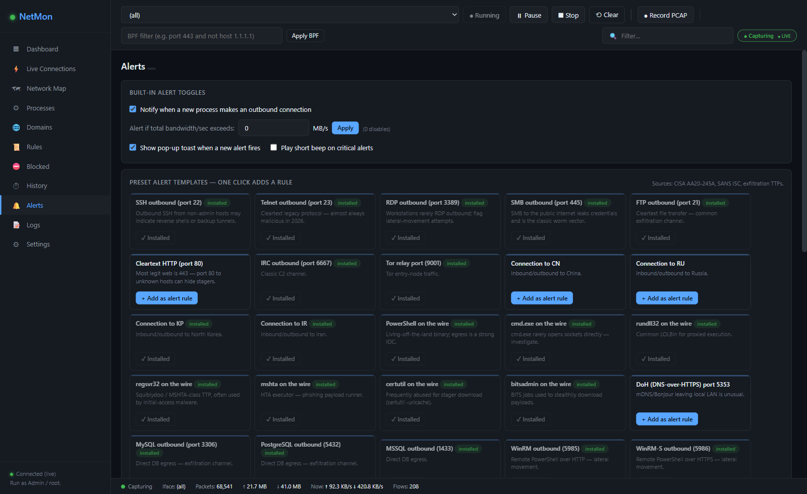
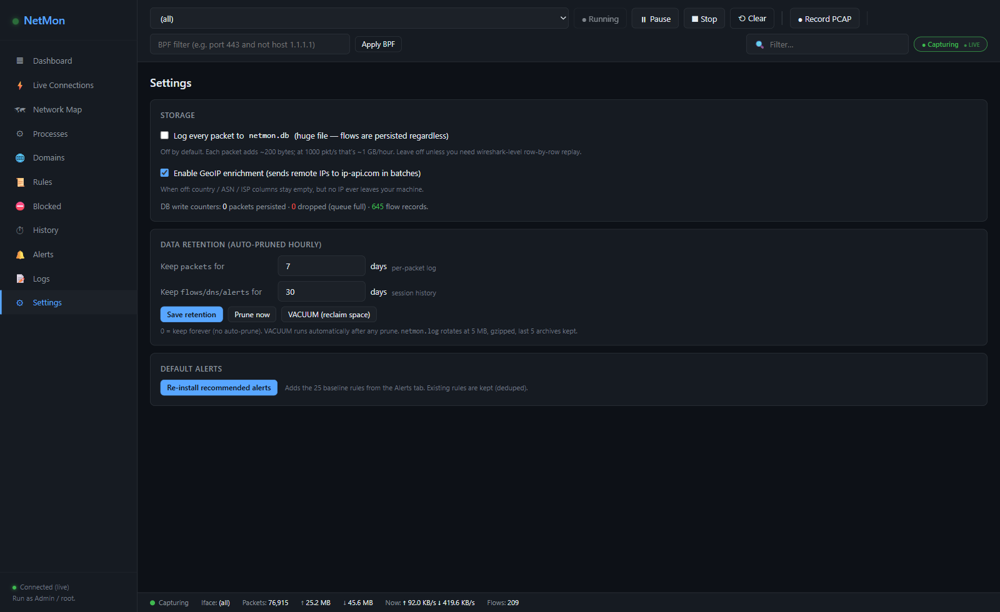
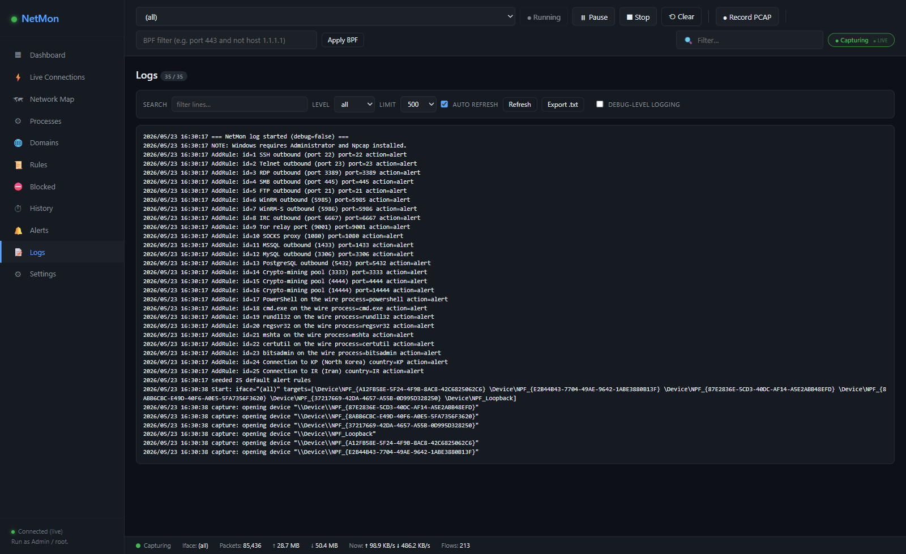

# NetMon-NetWork-Monitor

> Single-binary, browser-based network monitor + firewall for Linux / macOS / Windows.
> Captures every packet on every interface, attributes it to a process, enriches
> with GeoIP, and ships a real-time web UI that you can hit from anywhere on
> your LAN.

· Requires [Npcap](https://npcap.com) on Windows.



---

## Features

### Capture
- **All-interface concurrent capture** — one goroutine per NIC via `gopacket` / libpcap (Npcap on Windows).
- **Per-process attribution** — every flow tagged with PID + process name (via `gopsutil`).
- **DPI without port assumptions** — TLS SNI extracted from `ClientHello`, HTTP `Host` header sniffed off plaintext HTTP on any port.
- **DNS sniffing + reverse-DNS fallback** — `IP → hostname` map populated automatically; backfilled into live flows so chips/filters find them.
- **GeoIP + ASN enrichment** — country, city, ISP, ASN per remote IP (batched against ip-api.com, ≤10 req/min). Disable from Settings if leaking IPs bothers you.
- **PCAP recording** (off by default) — write a Wireshark-compatible `.pcap` on demand.
- **BPF filter** — tcpdump-style filters applied at capture-open time.

### Rules engine + alerts
- Declarative rules: `block` or `alert` on **process · country · ASN · IP/CIDR · port**.
- Hit counters, toggle, delete — all persisted to SQLite.
- **25+ recommended alert rules seeded on first launch** (port 22/23/445/3389/3306/5432, LOLBins powershell/cmd/rundll32/regsvr32/mshta/certutil/bitsadmin, KP/IR/etc).
- Bandwidth-spike + new-process built-in alerts.
- Toast notification + audible beep on new alerts (optional).

### Live web UI


- **Dashboard** — clickable cards (Uploaded WAN, Downloaded WAN, Active flows, Processes, Domains, Blocked, Rules, Alerts) each jumping into the relevant tab pre-filtered. WAN counters exclude loopback + RFC1918 LAN by default.
- **Live connections** — every flow with per-second ↑/↓ B/s rates, color-coded direction arrows, country flag, TLS SNI / HTTP Host badges, blocked / threat row highlighting.
- **Filter bar**: Proto · Direction · Scope (public / private / threat / blocked) · Min rate · Group by (process / domain / country).
- **Chip-based filters** — click any cell value (process, IP, port, country, host) to add a chip; shift-click negates. Chips persist across reloads. Chips for process / country / IP expose an inline **Block** button.
- **Quick presets** — HTTPS / HTTP / DNS / P2P / Public only / Threats / Active now.
- **Sortable headers**, pause-UI toggle, **export visible rows as CSV**, **export full snapshot as JSON** (suitable for LLM analysis).
- **Network Map** (D3 force-directed) — processes ↔ remote hosts, sized by traffic, color-coded by risk.
  
- **Processes tab** — per-process up/down rate + flows + remote-IP count + "view flows" jump.
  

### Alerts + presets


One-click alert presets (CISA AA20-245A + SANS ISC patterns): remote-access protocols, database egress, crypto-mining pools, Tor / SOCKS, suspicious LOLBin egress, high-risk country connections. Each preset already-installed presets render as **✓ Installed** so you never add the same rule twice.

### Storage + retention


- **SQLite** (`netmon.db`) — six tables, all metadata:
  - `flows` — one row per session (proto, IPs, ports, PID, process, **SNI, HTTP host, domain, country, ASN, ISP, sent, recv, threat, blocked**) — *system of record*.
  - `packets` — per-packet log, **OFF by default** (toggle in Settings).
  - `dns` — DNS answers seen on wire.
  - `blocked`, `alerts`, `rules` — block list / alert history / rule definitions.
- **Configurable retention** — packets default 7 days, flows/dns/alerts 30 days, both editable in Settings. `0 = keep forever`.
- **Auto-prune hourly**, **VACUUM** runs after prunes. Manual "Prune now" / "VACUUM now" buttons.
- **Periodic 30 s flow snapshots** — survives crash without data loss. `INSERT OR REPLACE` on composite key — no dupes.
- **No packet payloads** are ever stored. PCAP recording is the only payload-capable mode and is opt-in.

### Logs


- All log output → **stdout + rotating `netmon.log` (5 MB cap, gzipped, last 5 archives) + in-memory ring (last 2 000 lines)**.
- **Logs tab** with substring search, level filter (error/warn/info/debug), 200–2000 line buffer, auto-refresh, level-colored, **export as `.txt`**, runtime debug-toggle.

### Performance
- SQLite tuned: `journal=WAL`, `synchronous=NORMAL`, `cache_size=16MB`, `temp_store=MEMORY`, `mmap_size=256MB`, `busy_timeout=5s`.
- **One DB connection** (`SetMaxOpenConns(1)`) — all writers serialize through it instead of opening a connection storm under load.
- DNS + packet writes batched (1000 rows / 2 s) via dedicated worker goroutines — no per-packet goroutine spawns.
- Per-flow + per-process rate (`B/s`) computed once per second under the existing lock.

### Themes / accessibility
- **Dark · Midnight · Light** themes.
- **Compact mode**, **UI scale** 85 % → 120 %.
- **Keyboard shortcuts** (`?` to view): `1-9` switch tab · `/` focus search · `Esc` clear · `p` pause capture · `u` pause UI · `g` cycle group-by · `r` reset chips.
- All user prefs (filters · chips · sort · pause · theme · hidden cards/widgets · alert toggles) persisted in `localStorage`.

---

## Quick start

### Windows — pre-built binary (easiest, no compiler needed)
1. Install [Npcap](https://npcap.com) — tick **"WinPcap API-compatible Mode"**. *(Required: NetMon talks to the Npcap driver to capture packets.)*
2. Grab the latest binaries from the **[Releases](../../releases)** page:
   - `netmon.exe`  — console mode (foreground, shows logs in a terminal).
   - `netmonw.exe` — silent mode (no console window ever; for background / Task Scheduler).
3. Drop the `.exe` anywhere — it's fully self-contained (UI embedded via `//go:embed`).
4. **Double-click `netmon.exe` (or `netmonw.exe`).** A UAC prompt appears — click **Yes**. The binaries embed a `requireAdministrator` manifest so Windows auto-elevates; no need to right-click → Run as Administrator. *(Packet capture and firewall edits both require admin.)*

   Recommended silent launch:
   ```cmd
   netmonw.exe -autostart -open
   ```
   Boots silent, starts capture on all interfaces, opens the UI in your default browser.

   First run creates `netmon.db` (SQLite) and `netmon.log` in the working directory.

5. Open <http://127.0.0.1:18472> if `-open` wasn't used.

> The binaries are unsigned. SmartScreen may say "Windows protected your PC" the first time — click **More info → Run anyway**.

### Windows — build from source
1. Install [Npcap](https://npcap.com) — tick **"WinPcap API-compatible Mode"**.
2. Download the [Npcap SDK](https://npcap.com/dist/npcap-sdk-1.13.zip), extract somewhere (defaults expected at `.\npcap-sdk\`).
3. Install a C compiler (TDM-GCC, MinGW, or any mingw-w64; default expected at `.\gcc-mingw\bin\`).
4. **One-shot build (recommended):**
   ```cmd
   build.bat
   ```
   Produces both binaries:
   - `netmon.exe` — console mode (foreground, prints logs to terminal).
   - `netmonw.exe` — windowsgui mode (silent, no console popup ever).

   Override toolchain paths via env vars before running:
   ```cmd
   set NPCAP_SDK=C:\npcap-sdk
   set GCC_BIN=C:\TDM-GCC-64\bin
   build.bat
   ```

   Manual build (without the script):
   ```cmd
   set CGO_ENABLED=1
   set CGO_CFLAGS=-I C:\npcap-sdk\Include
   set CGO_LDFLAGS=-L C:\npcap-sdk\Lib\x64
   go build -trimpath -ldflags "-s -w" -o netmon.exe .
   go build -trimpath -ldflags "-s -w -H windowsgui" -o netmonw.exe .
   ```
5. Run **as Administrator**: `netmon.exe` (or `netmonw.exe -autostart -open` for silent).

### Linux
```bash
sudo apt install libpcap-dev gcc
git clone <repo> && cd netmon
go mod tidy
go build -o netmon .
sudo ./netmon
```

### macOS
```bash
git clone <repo> && cd netmon
go mod tidy
go build -o netmon .
sudo ./netmon
```

Then open <http://127.0.0.1:18472>.

### Flags
```
./netmon                         # listen on 127.0.0.1:18472 (loopback only)
./netmon -addr 0.0.0.0:18472     # all interfaces — PUT BEHIND AUTH
./netmon -log netmon.log         # log file (default; '-' to disable file)
./netmon -debug                  # enable debug-level logging
./netmon -autostart              # start capture immediately on launch
./netmon -iface "(all)"          # default interface when -autostart is set
./netmon -open                   # open the UI in your default browser
./netmon -background             # Windows: hide the console window after launch
```

The single binary embeds the entire UI (`//go:embed index.html`) — copy `netmon.exe` anywhere, no extra files needed.

### Run in the background (Windows, no console popup)

Two ways:

**1. Use the GUI subsystem build (no black box ever)**
```cmd
go build -ldflags="-H windowsgui" -o netmonw.exe .
netmonw.exe -autostart -open
```
`netmonw.exe` has no console attached at all — Explorer / scheduled tasks won't show a window. All output goes to `netmon.log`.

**2. Use the console binary with `-background`**
```cmd
netmon.exe -autostart -background
```
The console flashes briefly on startup, then `hideConsoleWindow` (Windows API) hides it.

### Run as a Windows service (Task Scheduler)
- Action: `netmonw.exe`
- Arguments: `-autostart -addr 127.0.0.1:18472`
- Run whether user is logged on or not — needs Administrator + Npcap.

---

## API

JSON in/out on every endpoint. WebSocket envelope: `{"type": "status"|"flows", "data": ...}`.

```
GET  /api/interfaces
GET  /api/status                       (push)
GET  /api/connections?limit=500&q=
GET  /api/processes?limit=300&q=
GET  /api/domains?limit=500&q=
GET  /api/blocked
GET  /api/alerts
GET  /api/history?seconds=3600&q=&limit=5000     # per-packet
GET  /api/flows-history?seconds=3600&q=&limit=1000   # enriched flow records
GET  /api/debug?limit=500              # in-memory log ring

POST /api/capture/start    {"iface": "(all)" | "eth0"}
POST /api/capture/stop
POST /api/capture/pause
POST /api/capture/bpf      {"filter": "port 443 and not host 1.1.1.1"}
POST /api/clear
POST /api/block            {"ip": "..."} | {"domain": "..."} | {"pid": 123}
POST /api/unblock          {"ip": "..."}
POST /api/pcap/start       {"path": "..."}   # optional
POST /api/pcap/stop
POST /api/alerts/config    {"new_process": true, "bw_threshold_mb": 5.0}

GET  /api/rules
POST /api/rules/add        {"name":"...", "match_type":"process|country|asn|cidr|port", "match_value":"...", "action":"block|alert"}
POST /api/rules/delete     {"id": 1}
POST /api/rules/toggle     {"id": 1, "enabled": false}

GET/POST /api/settings     {"geo_enabled":true, "log_packets":false,
                            "retention_packet_days":7, "retention_archive_days":30}
POST /api/maintenance      {"action":"prune"|"vacuum"}
POST /api/debug            {"enabled": true}

WS   /ws
```

---

## Architecture

```
                    ┌─── captureOnDevice (one goroutine per NIC) ───┐
                    │                                                │
   NICs ── libpcap ─┤  handlePacket ── decode ── DPI (SNI/Host) ──┐  │
                    │                                              │  │
                    └──────────────────────────────────────────────┘  │
                                                                       ▼
   m.flows[] / m.procs[] (in RAM, RW-mutex)        ┌─── bucketTicker (1s)
   ── current state, served to WS clients ─────────┤    ── per-flow B/s
                                                    │    ── push to WS subscribers
                                                    │    ── 30s flow snapshot → SQLite
                                                    └─── pruneTicker (5min idle → persist)

   DNS / SNI / Host  ─┐
   GeoIP batches      │── enrichment workers (own goroutines, bounded queues)
   reverse DNS        │
                       └─── backfill m.flows[].Domain on resolve

   m.dbQueue   ─── dbWorker  ── INSERT INTO packets   (batched, optional)
   m.dnsQueue  ─── dnsWorker ── INSERT INTO dns       (batched)
   persistFlow  ──             ── INSERT OR REPLACE INTO flows
   retentionTicker (1h) ── DELETE old rows + VACUUM
   rotatingFile  ──── netmon.log + gzip rotation

   Web layer:    net/http + gorilla/websocket
   HTML/JS:      //go:embed index.html  (Chart.js + D3 from CDN)
```

- Hot path: `IPv4/v6 + TCP/UDP` decode, DPI, per-flow + per-process counters all under **one** `sync.RWMutex`.
- Wire length read from `CaptureInfo.Length`, never the truncated capture length.
- SQLite single-connection pool prevents the connection storm that older builds hit under DNS load.

---

## Security notes

- Anyone reaching the listen port can **modify your firewall**. Default bind is loopback for this reason. Put a reverse proxy with auth in front before exposing.
- `Block()` validates input with `net.ParseIP` before invoking `netsh` / `iptables`.
- GeoIP queries leak observed remote IPs to ip-api.com — disable via Settings if that's a concern.
- This is not a kernel-level firewall on Windows — already-established TCP sessions take a moment to drop after a block. For instant kernel-level blocking on Windows you'd want a WFP driver (Portmaster has one).
- Per-packet logging (off by default) stores src/dst IPs + ports + process + length per packet — no payload, but consider it before turning on.

---

## Compared to other tools

- **Sniffnet** (Rust) — beautiful UI, no per-process attribution, no rules engine.
- **Portmaster** (Go) — kernel-level WFP blocking on Windows, heavier install.
- **OpenSnitch** (Linux) — application firewall, Linux only.
- **GlassWire** (proprietary) — Windows-only, closed source.

NetMon's angle: tiny single-binary Go agent + browser UI you can hit from anywhere on your LAN, **full DPI of TLS/HTTP headers**, **rule engine that operates on enriched fields** (country / ASN / process), per-process B/s rates, suspicious-process scoring, JSON snapshot export for LLM analysis.

---

## Roadmap / known limits

- No kernel-level packet blocking on Windows (uses `netsh advfirewall` shell-out).
- `packets` table grows fast if you enable per-packet logging — set a tighter retention.
- IPv6 GeoIP works but ip-api.com batching is IPv4-favored.
- No multi-host aggregation (single agent, single host).

---

## 📄 License

Apache License 2.0 — See [LICENSE](LICENSE) for details.

## 👤 Author

**Rahul P** — [@rahul1996pp](https://github.com/rahul1996pp)

If you find this useful, give it a ⭐ on [GitHub](https://github.com/rahul1996pp/netmon-network-monitor)!
